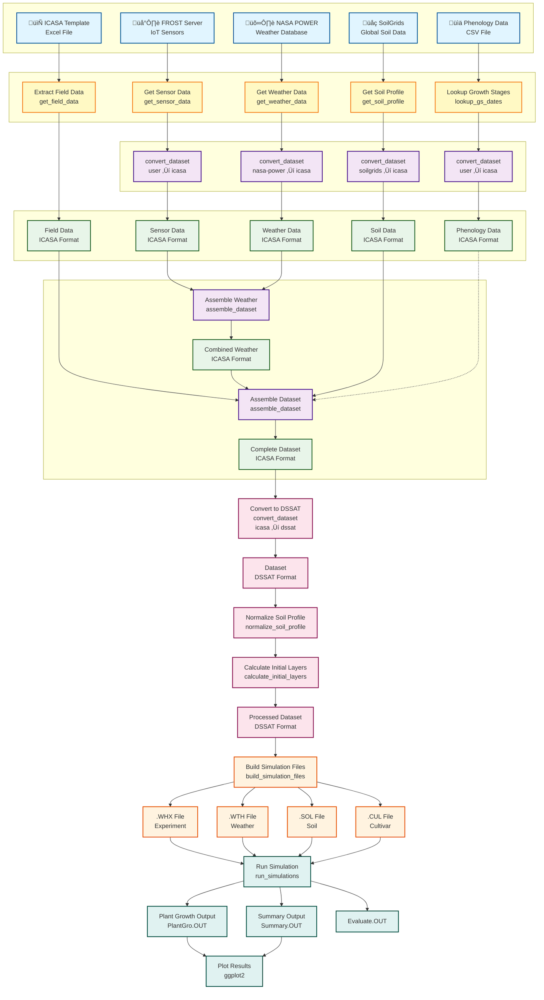
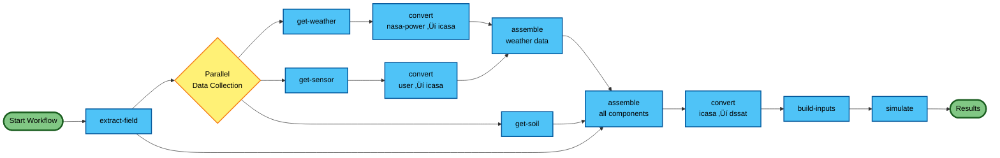
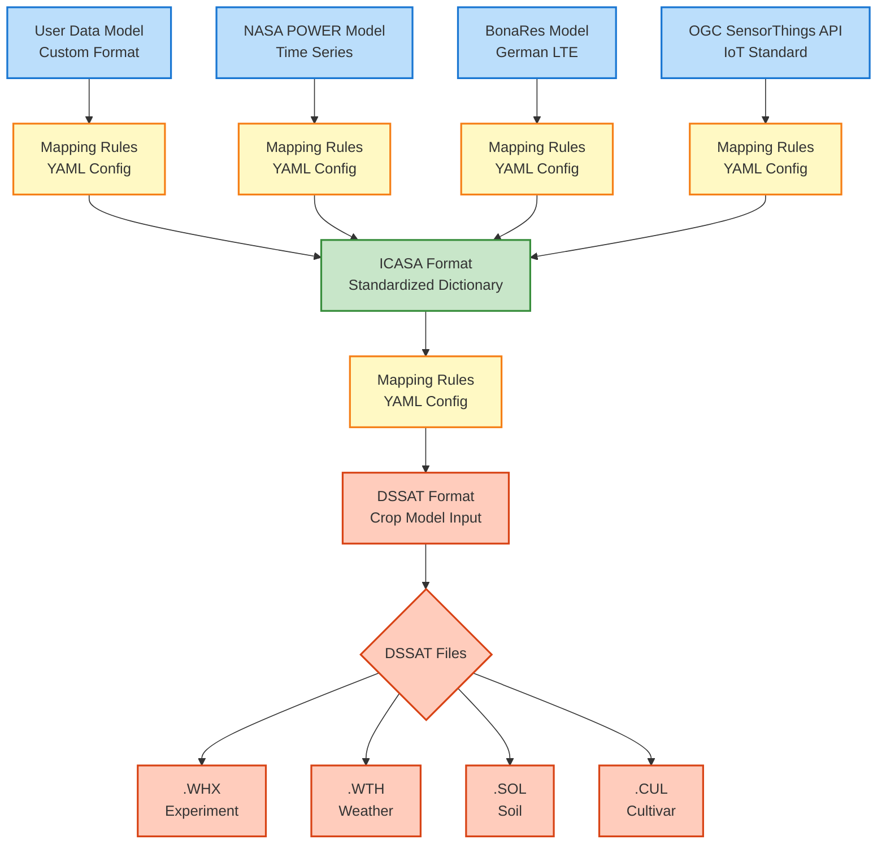
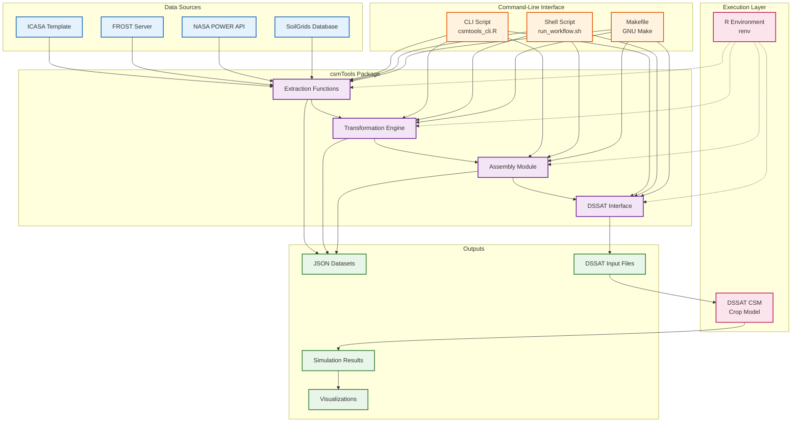
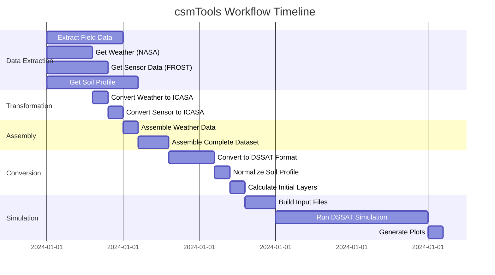

# csmTools Workflow Diagram

## Complete ETL Pipeline

```mermaid
flowchart TD
    %% Data Sources
    subgraph Sources[" "]
        Template[📄 ICASA Template<br/>Excel File]
        FROST[🌡️ FROST Server<br/>IoT Sensors]
        NASA[🛰️ NASA POWER<br/>Weather Database]
        SoilGrids[üåç SoilGrids<br/>Global Soil Data]
        Phenology[üìä Phenology Data<br/>CSV File]
    end
    
    %% Extraction Steps
    subgraph Extraction[" "]
        ExtractField[Extract Field Data<br/>get_field_data]
        GetSensor[Get Sensor Data<br/>get_sensor_data]
        GetWeather[Get Weather Data<br/>get_weather_data]
        GetSoil[Get Soil Profile<br/>get_soil_profile]
        LookupGS[Lookup Growth Stages<br/>lookup_gs_dates]
    end
    
    %% Transformation
    subgraph Transformation[" "]
        ConvertSensor[convert_dataset<br/>user ‚Üí icasa]
        ConvertWeather[convert_dataset<br/>nasa-power ‚Üí icasa]
        ConvertSoil[convert_dataset<br/>soilgrids ‚Üí icasa]
        ConvertPheno[convert_dataset<br/>user ‚Üí icasa]
    end
    
    %% ICASA Data
    subgraph IcasaData[" "]
        FieldICSA[Field Data<br/>ICASA Format]
        SensorICSA[Sensor Data<br/>ICASA Format]
        WeatherICSA[Weather Data<br/>ICASA Format]
        SoilICSA[Soil Data<br/>ICASA Format]
        PhenoICSA[Phenology Data<br/>ICASA Format]
    end
    
    %% Assembly
    subgraph Assembly[" "]
        AssembleWeather[Assemble Weather<br/>assemble_dataset]
        WeatherCombined[Combined Weather<br/>ICASA Format]
        AssembleDataset[Assemble Dataset<br/>assemble_dataset]
        CompleteICSA[Complete Dataset<br/>ICASA Format]
    end
    
    %% Connections - Sources to Extraction
    Template --> ExtractField
    FROST --> GetSensor
    NASA --> GetWeather
    SoilGrids --> GetSoil
    Phenology --> LookupGS
    
    %% Connections - Extraction to Transformation/ICASA
    ExtractField --> FieldICSA
    GetSensor --> ConvertSensor --> SensorICSA
    GetWeather --> ConvertWeather --> WeatherICSA
    GetSoil --> ConvertSoil --> SoilICSA
    LookupGS --> ConvertPheno --> PhenoICSA
    
    %% Connections - Weather Assembly
    SensorICSA --> AssembleWeather
    WeatherICSA --> AssembleWeather
    AssembleWeather --> WeatherCombined
    
    %% Connections - Dataset Assembly
    FieldICSA --> AssembleDataset
    WeatherCombined --> AssembleDataset
    SoilICSA --> AssembleDataset
    PhenoICSA -.-> AssembleDataset
    AssembleDataset --> CompleteICSA
    
    %% Conversion to DSSAT
    CompleteICSA --> ConvertDSSAT[Convert to DSSAT<br/>convert_dataset<br/>icasa ‚Üí dssat]
    ConvertDSSAT --> DatasetDSSAT[Dataset<br/>DSSAT Format]
    
    %% Data Processing
    DatasetDSSAT --> NormalizeSoil[Normalize Soil Profile<br/>normalize_soil_profile]
    NormalizeSoil --> CalcInitial[Calculate Initial Layers<br/>calculate_initial_layers]
    CalcInitial --> ProcessedData[Processed Dataset<br/>DSSAT Format]
    
    %% Build Simulation Files
    ProcessedData --> BuildFiles[Build Simulation Files<br/>build_simulation_files]
    BuildFiles --> FileX[.WHX File<br/>Experiment]
    BuildFiles --> FileW[.WTH File<br/>Weather]
    BuildFiles --> FileS[.SOL File<br/>Soil]
    BuildFiles --> FileT[.CUL File<br/>Cultivar]
    
    %% Run Simulation
    FileX --> RunSim[Run Simulation<br/>run_simulations]
    FileW --> RunSim
    FileS --> RunSim
    FileT --> RunSim
    
    %% Outputs
    RunSim --> PlantGrowth[Plant Growth Output<br/>PlantGro.OUT]
    RunSim --> Summary[Summary Output<br/>Summary.OUT]
    RunSim --> Evaluate[Evaluate.OUT]
    
    %% Visualization
    PlantGrowth --> Plot[Plot Results<br/>ggplot2]
    Summary --> Plot
    
    %% Styling
    classDef source fill:#e1f5ff,stroke:#01579b,stroke-width:2px
    classDef extract fill:#fff9c4,stroke:#f57f17,stroke-width:2px
    classDef transform fill:#f3e5f5,stroke:#4a148c,stroke-width:2px
    classDef icasa fill:#e8f5e9,stroke:#1b5e20,stroke-width:2px
    classDef dssat fill:#fce4ec,stroke:#880e4f,stroke-width:2px
    classDef files fill:#fff3e0,stroke:#e65100,stroke-width:2px
    classDef output fill:#e0f2f1,stroke:#004d40,stroke-width:2px
    
    class Template,FROST,NASA,SoilGrids,Phenology source
    class ExtractField,GetSensor,GetWeather,GetSoil,LookupGS extract
    class ConvertSensor,ConvertWeather,ConvertSoil,ConvertPheno,AssembleWeather,AssembleDataset transform
    class FieldICSA,SensorICSA,WeatherICSA,SoilICSA,PhenoICSA,WeatherCombined,CompleteICSA icasa
    class DatasetDSSAT,NormalizeSoil,CalcInitial,ProcessedData,ConvertDSSAT dssat
    class FileX,FileW,FileS,FileT,BuildFiles files
    class RunSim,PlantGrowth,Summary,Evaluate,Plot output
```

## CLI Command Flow

```mermaid
flowchart LR
    Start([Start Workflow]) --> ExtractCmd[extract-field]
    
    ExtractCmd --> Parallel{Parallel<br/>Data Collection}
    
    Parallel --> GetWeatherCmd[get-weather]
    Parallel --> GetSensorCmd[get-sensor]
    Parallel --> GetSoilCmd[get-soil]
    
    GetWeatherCmd --> ConvertWeather[convert<br/>nasa-power ‚Üí icasa]
    GetSensorCmd --> ConvertSensor[convert<br/>user ‚Üí icasa]
    
    ConvertWeather --> AssembleWeatherCmd[assemble<br/>weather data]
    ConvertSensor --> AssembleWeatherCmd
    
    AssembleWeatherCmd --> AssembleAll[assemble<br/>all components]
    GetSoilCmd --> AssembleAll
    ExtractCmd --> AssembleAll
    
    AssembleAll --> ConvertCmd[convert<br/>icasa ‚Üí dssat]
    
    ConvertCmd --> BuildCmd[build-inputs]
    
    BuildCmd --> SimulateCmd[simulate]
    
    SimulateCmd --> End([Results])
    
    %% Styling
    classDef cmdStyle fill:#4fc3f7,stroke:#01579b,stroke-width:2px,color:#000
    classDef parallelStyle fill:#fff176,stroke:#f57f17,stroke-width:2px,color:#000
    classDef startEnd fill:#81c784,stroke:#1b5e20,stroke-width:3px,color:#000
    
    class ExtractCmd,GetWeatherCmd,GetSensorCmd,GetSoilCmd,ConvertWeather,ConvertSensor,AssembleWeatherCmd,AssembleAll,ConvertCmd,BuildCmd,SimulateCmd cmdStyle
    class Parallel parallelStyle
    class Start,End startEnd
```

## Data Model Transformations

```mermaid
flowchart TD
    %% Input Models
    UserData[User Data Model<br/>Custom Format]
    NASAPower[NASA POWER Model<br/>Time Series]
    BonaRes[BonaRes Model<br/>German LTE]
    SensorAPI[OGC SensorThings API<br/>IoT Standard]
    
    %% Target Models
    UserData --> MapUser[Mapping Rules<br/>YAML Config]
    NASAPower --> MapNASA[Mapping Rules<br/>YAML Config]
    BonaRes --> MapBonaRes[Mapping Rules<br/>YAML Config]
    SensorAPI --> MapSensor[Mapping Rules<br/>YAML Config]
    
    MapUser --> ICASA[ICASA Format<br/>Standardized Dictionary]
    MapNASA --> ICASA
    MapBonaRes --> ICASA
    MapSensor --> ICASA
    
    ICASA --> MapDSSAT[Mapping Rules<br/>YAML Config]
    MapDSSAT --> DSSAT[DSSAT Format<br/>Crop Model Input]
    
    DSSAT --> DSSATFiles{DSSAT Files}
    
    DSSATFiles --> FileX[.WHX<br/>Experiment]
    DSSATFiles --> FileW[.WTH<br/>Weather]
    DSSATFiles --> FileS[.SOL<br/>Soil]
    DSSATFiles --> FileC[.CUL<br/>Cultivar]
    
    %% Styling
    classDef input fill:#bbdefb,stroke:#1976d2,stroke-width:2px
    classDef mapping fill:#fff9c4,stroke:#f57f17,stroke-width:2px
    classDef standard fill:#c8e6c9,stroke:#388e3c,stroke-width:2px
    classDef output fill:#ffccbc,stroke:#d84315,stroke-width:2px
    
    class UserData,NASAPower,BonaRes,SensorAPI input
    class MapUser,MapNASA,MapBonaRes,MapSensor,MapDSSAT mapping
    class ICASA standard
    class DSSAT,DSSATFiles,FileX,FileW,FileS,FileC output
```

## System Architecture

```mermaid
graph TB
    subgraph "Data Sources"
        A1[ICASA Template]
        A2[FROST Server]
        A3[NASA POWER API]
        A4[SoilGrids Database]
    end
    
    subgraph "csmTools Package"
        B1[Extraction Functions]
        B2[Transformation Engine]
        B3[Assembly Module]
        B4[DSSAT Interface]
    end
    
    subgraph "Command-Line Interface"
        C1[CLI Script<br/>csmtools_cli.R]
        C2[Shell Script<br/>run_workflow.sh]
        C3[Makefile<br/>GNU Make]
    end
    
    subgraph "Execution Layer"
        D1[R Environment<br/>renv]
        D2[DSSAT CSM<br/>Crop Model]
    end
    
    subgraph "Outputs"
        E1[JSON Datasets]
        E2[DSSAT Input Files]
        E3[Simulation Results]
        E4[Visualizations]
    end
    
    A1 & A2 & A3 & A4 --> B1
    B1 --> B2
    B2 --> B3
    B3 --> B4
    
    C1 & C2 & C3 --> B1 & B2 & B3 & B4
    
    B1 & B2 & B3 --> E1
    B4 --> E2
    E2 --> D2
    D2 --> E3
    E3 --> E4
    
    D1 -.-> B1 & B2 & B3 & B4
    
    %% Styling
    classDef sources fill:#e3f2fd,stroke:#1565c0,stroke-width:2px
    classDef package fill:#f3e5f5,stroke:#6a1b9a,stroke-width:2px
    classDef cli fill:#fff3e0,stroke:#e65100,stroke-width:2px
    classDef exec fill:#fce4ec,stroke:#c2185b,stroke-width:2px
    classDef outputs fill:#e8f5e9,stroke:#2e7d32,stroke-width:2px
    
    class A1,A2,A3,A4 sources
    class B1,B2,B3,B4 package
    class C1,C2,C3 cli
    class D1,D2 exec
    class E1,E2,E3,E4 outputs
```

## Parallel Processing Opportunities

```mermaid
gantt
    title csmTools Workflow Timeline
    dateFormat YYYY-MM-DD
    
    section Data Extraction
    Extract Field Data       :a1, 2024-01-01, 5m
    Get Weather (NASA)       :a2, 2024-01-01, 3m
    Get Sensor Data (FROST)  :a3, 2024-01-01, 4m
    Get Soil Profile         :a4, 2024-01-01, 6m
    
    section Transformation
    Convert Weather to ICASA :b1, after a2, 1m
    Convert Sensor to ICASA  :b2, after a3, 1m
    
    section Assembly
    Assemble Weather Data    :c1, after b1 b2, 1m
    Assemble Complete Dataset:c2, after a1 c1 a4, 2m
    
    section Conversion
    Convert to DSSAT Format  :d1, after c2, 3m
    Normalize Soil Profile   :d2, after d1, 1m
    Calculate Initial Layers :d3, after d2, 1m
    
    section Simulation
    Build Input Files        :e1, after d3, 2m
    Run DSSAT Simulation     :e2, after e1, 10m
    Generate Plots           :e3, after e2, 1m
```
