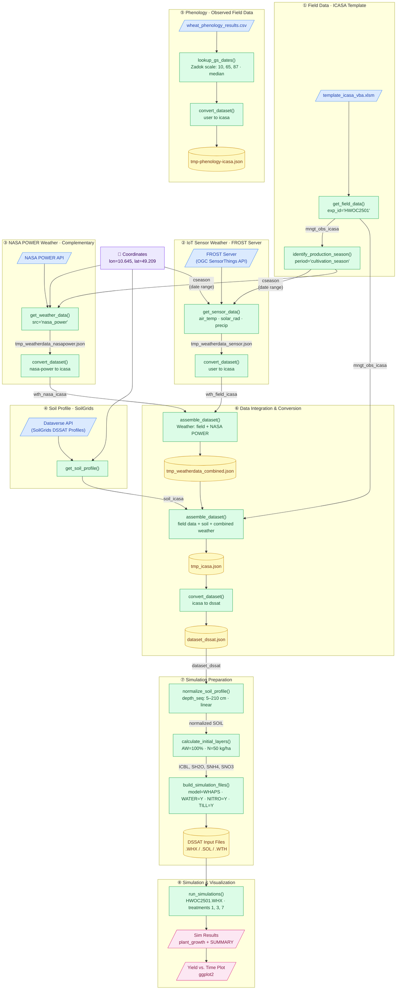

# Workflow Diagram – Ochsenwäsen Experiment

## Legend

| Shape | Meaning |
|---|---|
| 🔵 Parallelogram | External input source or final output |
| 🟢 Rectangle | Processing step (R function call) |
| 🟡 Cylinder | Intermediate file written to `./archive/` |
| 🟣 Rectangle | Fixed coordinates (shared input) |

## Notes

- **⑤ Phenology** (`lookup_gs_dates` → `convert_dataset`) produces `tmp-phenology-icasa.json` but is not yet wired into the main `assemble_dataset` call in step ⑥; it is included here for completeness.
- Steps ② and ③ run in parallel and are both gated on the `cseason` date range derived from step ①.
- Step ④ (soil profile) is independent of the field data timing and can run in parallel with ②–③.
- The final simulation step requires a local installation of DSSATCSM.
